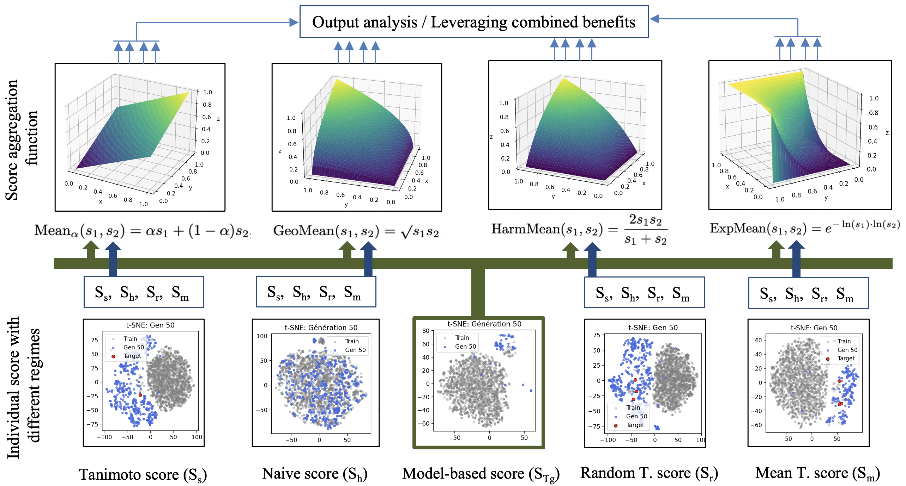

#  Multi-Score Reinforcement Learning for High-Tg Polyimide Design

##  Overview
This repository contains the code and data for the study **“Multi-Score Reinforcement Learning for High-Tg Polyimide Design.”**  
The project investigates strategies for generating **polyimides with high glass transition temperatures (Tg)** using **reinforcement learning (RL)**, emphasizing how different **scoring functions and combination strategies** affect both **polymer quality** and **structural diversity**.

Traditional RL approaches rely on a single predictive score to guide molecular generation. Here, we explore alternative strategies, including:

- **Model-based score (STg)**: Score based on Tg prediction model  
- **Naïve Shapley-based score (Sh)**: weighted sum of Shapley contributions from the Tg prediction model  
- **Tanimoto similarity scores**:
  - *Simple (Ss)*: direct comparison to a target polymer  
  - *Randomized (Sr)*: alternating between multiple targets  
  - *Mean (Sm)*: average similarity across reference polymers  

We systematically analyze these scores individually and in combination to study their impact on **exploration vs. exploitation trade-offs** during molecular generation.

---

## ⚙️ Framework and Methodology
Experiments are conducted using the **[REINVENT](https://github.com/MolecularAI/Reinvent)** framework with:

- A fixed prior generative model  
- Consistent fine-tuning parameters  
- Variations in scoring strategies and **Experience Replay (ER)** usage  

Analysis includes:

- Tg prediction modeling  
- Evaluation of Shapley and Tanimoto-based scoring functions  
- Comparison of multiple score aggregation methods (arithmetic, geometric, harmonic, ExpMean)  

---

### ⚠️ Notes on Large Files
- **Synthetic polyimides dataset** (`/datasets/Polyimides_synthetic.csv`) was removed due to size; the original file is available [here](https://github.com/polycomplab/GCNN_PI_glass_transition).  
- The folder `/data/results` contains saved RL models. For space, **only one model is included** to illustrate the workflow.  
- Random Forest models (`random_forest_model_500k.pkl` and `random_forest_model.pkl`) were removed (1 GB and 12 GB respectively). The **code to generate these models** is available in `/models_jupyter/reinvent_benchmarking/Pred_Tg/PI_Tg_Prediction.py`.

### Notes
- The **main script** is: `/models_jupyter/reinvent.py` It contains the full RL workflow and, in comments, the algorithms used to generate the figures presented in the paper.
- All the generated polyimides are stored in the folder: "/data/results"
